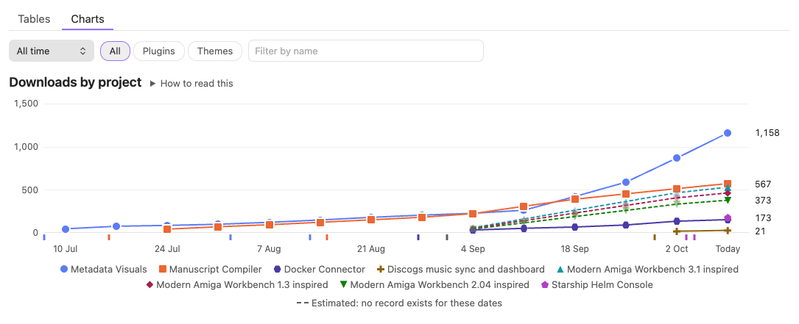
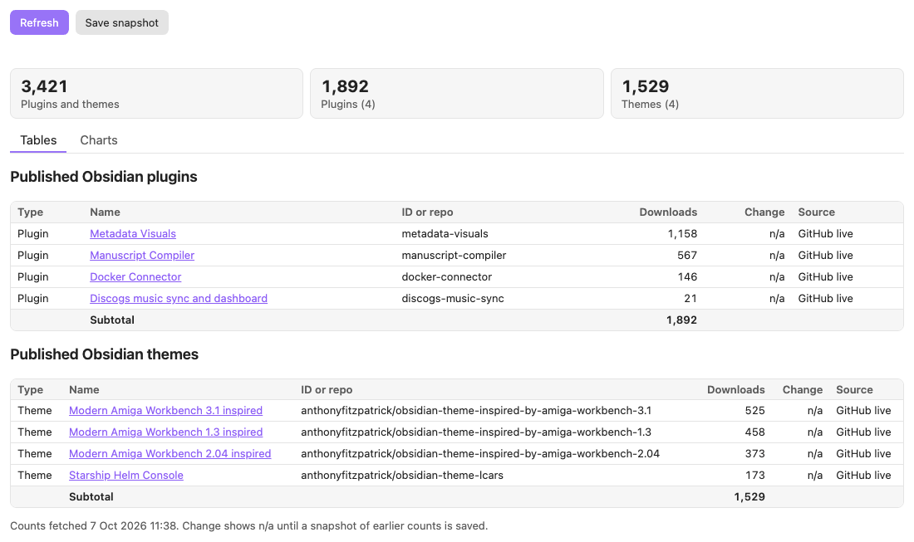
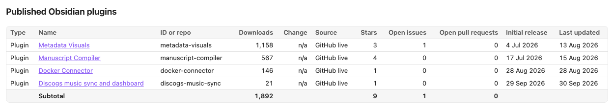
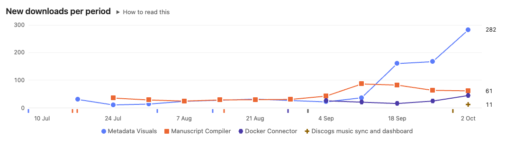
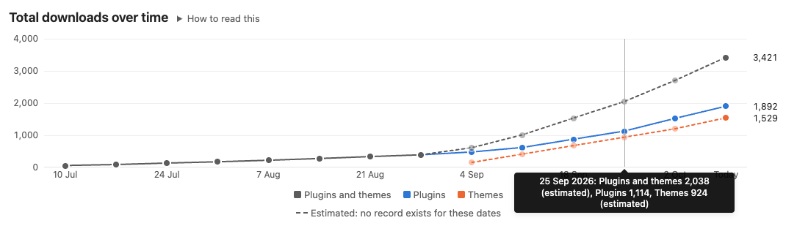
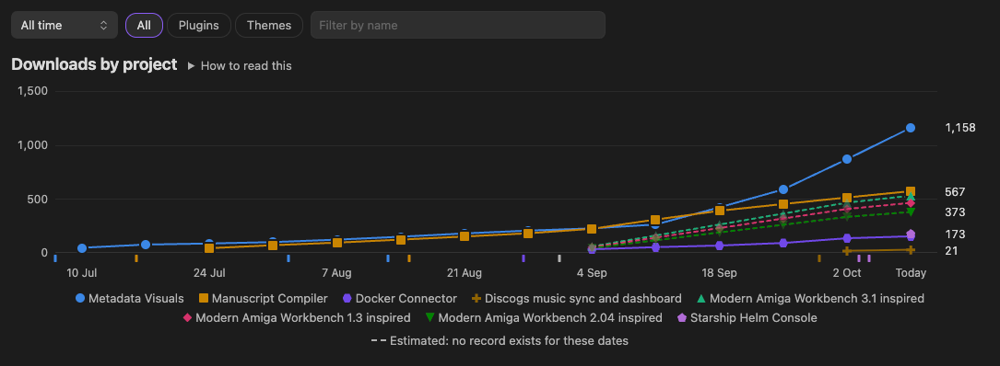
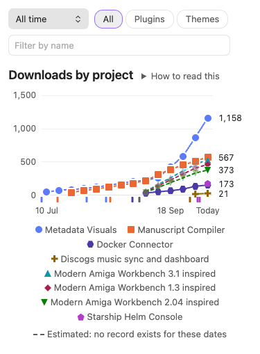

# Download Tracker

An Obsidian plugin for people who publish community plugins and themes. It shows how many times each of your plugins and themes has been downloaded, how that has changed over time, and when each release went out, all inside Obsidian.



## What it does

**Download counts**

- Finds every plugin and theme in Obsidian's community directory whose repository belongs to one of your GitHub usernames. You can add repositories from other accounts too.
- Shows each one's download count, the change since your last snapshot, and where the count came from, with subtotals and a combined total.
- Counts other GitHub repositories you name, such as tools that aren't Obsidian plugins, in a separate table. Their counts are kept apart because they are measured differently.

**Optional columns**, each turned on in settings:

- Downloads of each released version.
- GitHub stars, open issues and open pull requests.
- The date of the first and the latest published release.
- Every repository you own, public and private, tagged with its visibility.

**History and charts**

- Saves dated snapshots of the counts, by command or automatically once a day.
- Draws three charts on a separate tab: downloads by project, new downloads per period, and total downloads over time. Plugin history goes back to each plugin's first appearance in Obsidian's directory, using the daily figures Obsidian publishes.
- Filters the charts by date range (last 7 days, month, quarter, year or all time), by type and by name.
- Marks each release on the per-project charts, and gives every project its own colour and point shape in light and dark mode.
- Draws the charts itself in plain HTML and SVG; no other plugin or chart library is needed.

**Sharing**

- Writes the snapshot history to a note as a Markdown table.
- Copies a plain-text summary to the clipboard, or inserts a summary table into the current note.

It shows nothing else about your repositories beyond the optional columns above. Stars, issues and pull requests are shown as they are now; snapshots record downloads only.

## Screenshots

The dashboard has two tabs. **Tables** lists every project with its counts:



Optional columns add stars, open issues, open pull requests and release dates:



**Charts** shows the same projects over time. New downloads per period shows whether each project is speeding up or slowing down:



Total downloads over time adds up plugins, themes and both. Hovering over a date lists every value for it:



The charts follow Obsidian's light and dark mode, and fit a phone screen:





The [user guide](USER_GUIDE.md) has a screenshot for every part of the plugin.

## Requirements

- Obsidian 1.13.0 or later, on desktop or mobile. The plugin keeps your GitHub token in Obsidian's secret storage, and describes its settings with Obsidian's declarative settings API, which puts them in Obsidian's settings search.
- At least one plugin or theme in Obsidian's community directory, or a GitHub repository with releases.
- A GitHub token is optional. Without one, GitHub allows 60 requests an hour from your network, which is enough for a handful of plugins. A token raises that to 5,000.

## Install

Until the plugin is in the community directory:

1. Download `main.js`, `manifest.json` and `styles.css` from the latest release on GitHub.
2. In your vault, create the folder `.obsidian/plugins/download-tracker` and put the three files in it.
3. In Obsidian, open **Settings → Community plugins**, reload the list of installed plugins and turn on **Download Tracker**.

## Quick start

1. Open **Settings → Download Tracker** and enter your GitHub username under **GitHub usernames**.
2. Optionally, add a GitHub token under **GitHub token**. The [user guide](USER_GUIDE.md#add-a-github-token) explains which kind to create.
3. Select the download icon in the ribbon, or run **Download Tracker: Open dashboard** from the command palette.
4. Turn on **Save a snapshot each day** and **Refresh on startup** if you want the plugin to build a history of your theme downloads from now on.

## How counts are calculated

- **Plugins.** The plugin sums the downloads of the `manifest.json` file attached to each GitHub release of the plugin. Obsidian downloads that file once for every install and every update, and builds its own count the same way, so this matches the number in Obsidian's plugin browser but is current. These counts are labelled "GitHub live".
- **Fallback.** If GitHub refuses a request because of the rate limit or a rejected token, the plugin uses Obsidian's stats file instead and says so on the dashboard. Obsidian updates the stats file on its own schedule, and it can be days behind. These counts are labelled "Obsidian stats file".
- **Themes.** A theme released on GitHub with a `manifest.json` attached to each release is counted the same way as a plugin, labelled "GitHub live". Older themes that install straight from the repository use Obsidian's theme statistics, labelled "Obsidian stats file", which can lag. If neither can be loaded, the theme shows "n/a" and the rest of the refresh still completes.
- **Other repositories.** An extra repository that isn't in Obsidian's community lists is shown under "Other repositories". Its count is the sum of the downloads of every file attached to its GitHub releases, labelled "GitHub release files". One person downloading three files counts three times, GitHub doesn't count its automatic source-code archives, and installs through package managers aren't included. These counts are kept out of the plugins and themes total.
- **All repositories and visibility.** With this setting on, every repository owned by your GitHub usernames is listed, except forks, and every row is tagged Public or Private. Plugins and themes in Obsidian's directory are always public. Private repositories appear only when the GitHub token belongs to that account and can read them, for example a fine-grained token with read-only Contents access.
- **Open issues and pull requests.** GitHub's own open-issue number includes pull requests, so the plugin lists the open issues and leaves pull requests out. Open pull requests come from GitHub's pull request list. A repository with nothing open costs no extra request. A repository with issues or pull requests turned off shows n/a for that column. For private repositories, the token needs read-only Issues or Pull requests access.
- **Release dates.** The initial release is the date of the earliest published GitHub release and the last updated date is that of the latest one. Drafts and pre-releases are ignored, because Obsidian doesn't install them. When GitHub can't be reached, a plugin's last updated date comes from Obsidian's stats file. Dates are shown in your local time zone, in the format set under **Date format**, or in your Obsidian language's format if that is empty. Exported history and summaries always use `YYYY-MM-DD HH:mm`.
- **Download history.** For plugins, the charts use real past totals. Obsidian commits its plugin stats file to the `obsidianmd/obsidian-releases` repository once a day, so the plugin reads the version from each date it charts. Obsidian publishes no such history for themes: its theme statistics give only today's total, and that repository has no theme stats file. Theme history therefore starts with your own snapshots, and the weeks between a theme's release and your first snapshot are estimated and drawn dashed. Turn on **Save a snapshot each day** to record theme history from now on.
- **New downloads per period.** The gain in each complete period is the difference between two recorded totals. The period still running is left out, because it is partial and its total comes from GitHub while the others come from Obsidian's daily figures. Estimated totals give no gains.

## Limits

- A download is an install or an update, not a person. Updating a plugin, or installing it in a second vault, counts again.
- A plugin or theme appears only once it is in Obsidian's community lists. Projects still in review are not shown, unless you add them as extra repositories, where they are counted as other repositories.
- Obsidian keeps no download history for themes, so theme totals before your first snapshot can't be known. The charts estimate them as a straight rise from zero at release and draw them dashed; they are not recorded figures. GitHub keeps no history either, for plugins, themes or other repositories: release download counts are running totals with no dates.
- Obsidian's daily plugin figures run a few days behind GitHub, so the last point of a plugin's line, today's live count, can sit higher than the trend before it.
- The change column compares with the most recent snapshot saved before the counts were fetched. If the count's source differs from the snapshot's, for example a live count saved and a stats-file count now, the change shows n/a rather than a false difference.
- Without a token, GitHub allows 60 requests an hour from your network. Each plugin, theme and other repository takes at least one request per refresh. Showing stars adds one request per repository; listing all repositories adds one request per page of 100 repositories plus at least one per repository; open issues and open pull requests each add one request per repository that has anything open. The charts add one request for each past date they show, the first time only, because each date is kept.
- More than eight projects in one chart can't all get distinct colours, so the smallest share one grey "Other" line.

## Network use

The plugin connects to these hosts only when you open the dashboard or its charts, run a command that needs counts, or turn on refresh at startup:

- `raw.githubusercontent.com`: Obsidian's community plugin list, theme list and plugin stats file, from the `obsidianmd/obsidian-releases` repository. For the charts it also reads past versions of the stats file, one for each date shown (daily for the last 7 days, every 3 days for the last month, then weekly or monthly). Each is about 2 MB, so the first time the charts open they can download a few tens of megabytes. Only your plugins' numbers are kept, and each date is fetched once.
- `api.github.com`: the release list of each of your plugins, themes and other repositories, to read download counts and release dates; the commit history of Obsidian's stats file, to find its version at each date the charts show; and, only for the settings you turn on, each repository's details (stars, visibility and whether issues or pull requests are open), its open issues and pull requests, the list of repositories you own, and the account the token belongs to. If you set a token, it is sent only to this host.
- `releases.obsidian.md`: Obsidian's theme download statistics, for themes without GitHub release counts.

## Privacy

The plugin has no telemetry, analytics or accounts, and sends nothing about you or your vault anywhere. The requests above read public data, and your private repositories only if your token allows it. Apart from repository names, the only thing they carry is your GitHub token, if you set one, and only to `api.github.com`.

The plugin writes to the clipboard only when you run **Copy summary to clipboard**, and never reads it.

The GitHub token is stored in Obsidian's secret storage, not in the plugin's files. A classic token with no scopes is enough for public repositories, because the plugin only reads public data. To include private repositories, use a fine-grained token with read-only access; it can read those repositories' code if it leaks, but it can't change anything.

## What the plugin stores

Everything is kept in the plugin's `data.json` in your vault, at `.obsidian/plugins/download-tracker/data.json`:

- Your settings, apart from the token.
- The counts from the last refresh, so the dashboard opens without waiting.
- Your snapshots.
- Your plugins' totals from Obsidian's past daily files, one small entry per date, so each date is downloaded once.

The file stays small: tens of kilobytes for a handful of projects. To start over, close Obsidian and delete it.

## Development

```bash
npm install
npm test
npm run build
```

`npm run dev` rebuilds on every change. To copy each build into a vault, put the path of the vault's `.obsidian/plugins/download-tracker` folder in a file named `.dev-plugin-dir` at the repository root. Git ignores that file.

Pushing a version tag starts the release workflow. It checks the tag against `manifest.json` and `versions.json`, runs the linter and tests, builds twice to check the output is identical, attests `main.js`, `manifest.json` and `styles.css`, and creates a draft release.

## Credits

Created by Anthony Fitzpatrick at Wolf 359 Press AB. Released under the MIT licence.

To report a bug or request a feature, use the links in the About panel at the bottom of the plugin's settings, or open an issue on GitHub. If the plugin is useful to you, you can [buy me a coffee](https://buymeacoffee.com/wolf359pressab).
