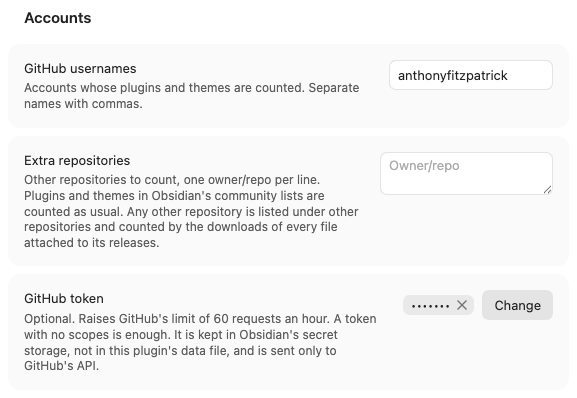
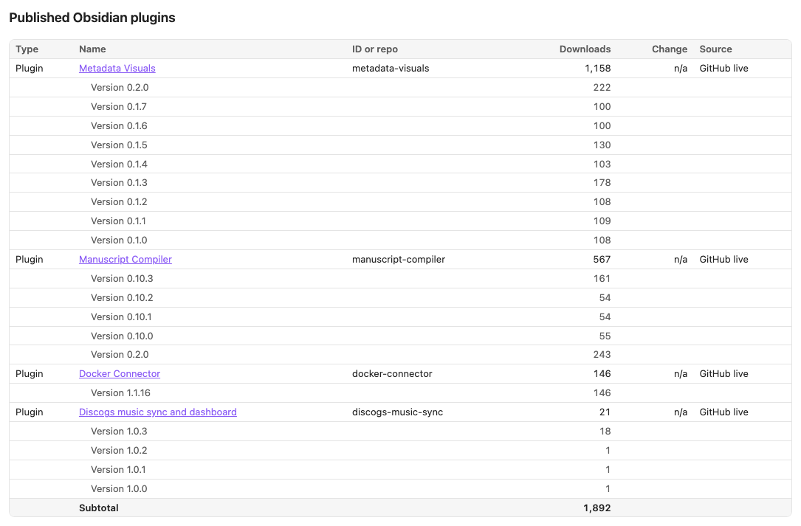
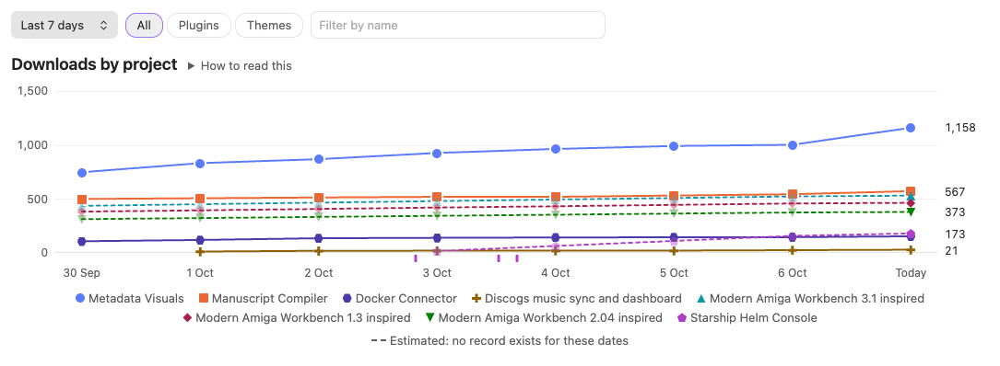
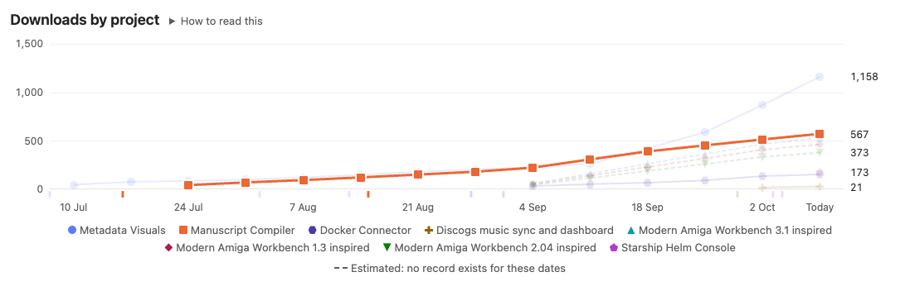
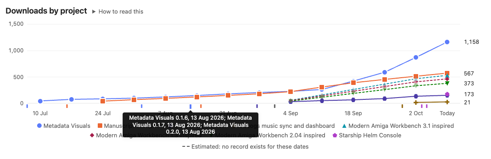
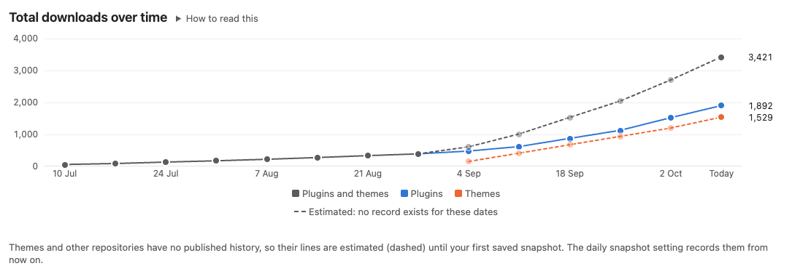
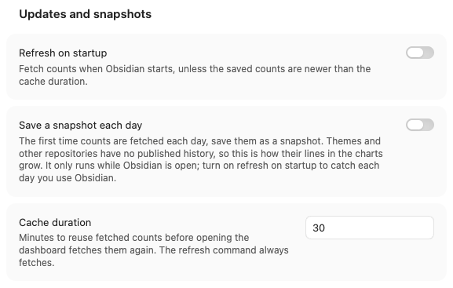
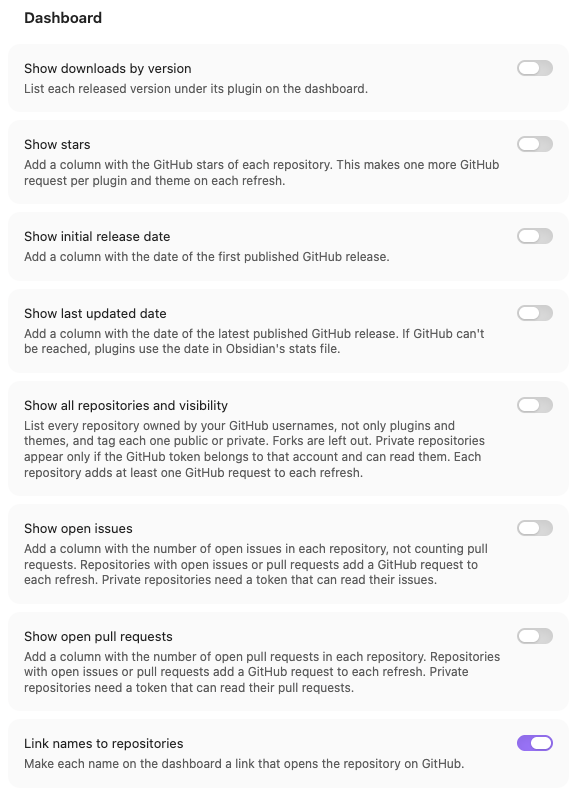
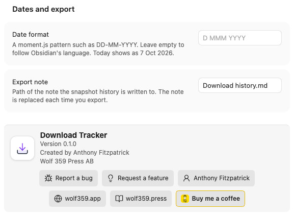

# Download Tracker user guide

This guide is organised by task. Each section says what to do, what you will see, and what the numbers mean. The screenshots come from a fresh install of the released plugin, set up the way this guide describes.

- [Set up](#set-up)
- [Add a GitHub token](#add-a-github-token)
- [Read the dashboard](#read-the-dashboard)
- [Show more columns](#show-more-columns)
- [Read the charts](#read-the-charts)
- [What Obsidian doesn't publish](#what-obsidian-doesnt-publish)
- [Save a snapshot](#save-a-snapshot)
- [Export history](#export-history)
- [Share the current counts](#share-the-current-counts)
- [Settings reference](#settings-reference)
- [Troubleshooting](#troubleshooting)
- [Report a bug or request a feature](#report-a-bug-or-request-a-feature)

## Set up

When you first open the dashboard, it asks for a GitHub username, because it doesn't yet know whose plugins to look for:

1. Open **Settings → Download Tracker**. The settings are grouped under four headings: Accounts, Updates and snapshots, Dashboard, and Dates and export. You can also find any of them with Obsidian's settings search, for example by typing "cache duration".
2. Under **Accounts → GitHub usernames**, enter the GitHub account your plugins and themes are published from. For several accounts, separate them with commas.
3. If a plugin or theme of yours is published from an account that isn't listed, add it under **Extra repositories** as `owner/repo`, one per line. A plugin or theme found this way is counted like your own. A repository that isn't in Obsidian's community lists appears in a separate table of other repositories.
4. Optionally, add a GitHub token. See [Add a GitHub token](#add-a-github-token).

Then open the dashboard with the download icon in the ribbon, or run **Download Tracker: Open dashboard** from the command palette. The first load takes a few seconds while the plugin reads Obsidian's community lists and each project's GitHub releases; progress shows at the top of the dashboard.

## Add a GitHub token

A token is optional. Without one, GitHub allows 60 requests an hour from your network. Each refresh uses at least one request per plugin, theme and other repository, and the charts use one more for each past date the first time they show it. With a token the limit is 5,000 an hour.

The token is kept in Obsidian's secret storage, not in the plugin's files, and the plugin sends it only to `api.github.com`.

**For public projects only**, a classic token with no permissions is enough:

1. On GitHub, open **Settings → Developer settings → Personal access tokens → Tokens (classic)** and select **Generate new token (classic)**.
2. Give it a name you will recognise, such as "Obsidian Download Tracker", and choose when it expires.
3. Leave every scope unticked, and select **Generate token**. Copy the token; GitHub shows it only once.
4. In Obsidian, open **Settings → Download Tracker → GitHub token**, select **Link**, create a new secret and paste the token.

**To include private repositories**, use a fine-grained token with read-only access instead:

1. On GitHub, open **Settings → Developer settings → Personal access tokens → Fine-grained tokens** and select **Generate new token**.
2. Set **Repository access** to **All repositories**, or choose only the repositories you want listed.
3. Under **Repository permissions**, set **Contents** to **Read-only**. To count issues and pull requests in private repositories as well, also set **Issues** and **Pull requests** to **Read-only**. Leave everything else at **No access**.
4. Generate the token and put it in the **GitHub token** setting as above.

A read-only token can read the code of the repositories it covers if it leaks, but it can't change anything.

## Read the dashboard

At the top are two buttons. **Refresh** fetches new counts now. **Save snapshot** saves the counts on screen, as described in [Save a snapshot](#save-a-snapshot).

Below them, tiles show the combined total for plugins and themes, then each group's total with the number of projects in brackets. If you count other repositories, a fourth tile shows their total; it is not part of the plugins and themes total, because those repositories are counted differently.

Under the tiles are two tabs. **Tables** lists your projects; **Charts** draws them over time. The dashboard remembers which tab you used last.

The Tables tab has a table of published Obsidian plugins, a table of published Obsidian themes and, if you count other repositories, a table of those. Each table is sorted by downloads, largest first, and ends with a subtotal.

| Column | Meaning |
| --- | --- |
| Type | Plugin, theme or repository. |
| Name | The name in Obsidian's community directory, or the repository name. With **Link names to repositories** on (the default), it opens the repository on GitHub. |
| ID or repo | The plugin ID, or the GitHub repository of a theme or other repository. |
| Downloads | Installs and updates, not people. Updating a plugin, or installing it in a second vault, counts again. |
| Change | The difference from your last snapshot. It shows n/a until there is a snapshot to compare with, and when the count now comes from a different source than in the snapshot. |
| Source | Where the count came from: GitHub live, GitHub release files, Obsidian stats file, or Not available. |

The line under the tables says when the counts were fetched and which snapshot the Change column compares with.

Counts are reused for the number of minutes set in **Cache duration** (30 by default), so opening the dashboard again doesn't fetch everything again. Select **Refresh**, or run **Download Tracker: Refresh counts**, to fetch new counts at any time.

Messages between the buttons and the tiles tell you when something couldn't be loaded. The most common is GitHub's rate limit: the affected plugins and themes then show Obsidian's stats file count, which may be a few days old. See [Troubleshooting](#troubleshooting) for each message.

## Show more columns

Each of these is turned on under **Settings → Download Tracker → Dashboard**.

| Column | Setting | Meaning |
| --- | --- | --- |
| Visibility | Show all repositories and visibility | Public or Private. |
| Stars | Show stars | The repository's GitHub stars today. |
| Open issues | Show open issues | Open issues, not counting pull requests. |
| Open pull requests | Show open pull requests | Open pull requests. |
| Initial release | Show initial release date | The date of the first published GitHub release. |
| Last updated | Show last updated date | The date of the latest published GitHub release. |

Release dates ignore drafts and pre-releases, because Obsidian doesn't install them. A project with no published GitHub releases shows n/a.

Stars, issues and pull requests are shown as they are now; snapshots don't record them. Each costs GitHub requests: stars one per repository, and issues and pull requests one each per repository that has anything open.

**Downloads by version.** Turn on **Show downloads by version** to list each released version under its plugin or theme, newest first. A theme that installs straight from its repository, rather than from GitHub releases, has no per-version counts.

**All repositories and visibility.** Turn on **Show all repositories and visibility** to list every repository owned by your GitHub usernames, not only plugins and themes. Repositories that aren't Obsidian plugins or themes are added to the other repositories table, and a Visibility column tags every row Public or Private. Forks are left out. Private repositories appear only when the GitHub token belongs to that account and can read them; see [Add a GitHub token](#add-a-github-token).

Other repositories are counted by every file attached to their GitHub releases, so one person downloading three files counts three times. Their numbers mean something different from Obsidian downloads, which is why they have their own table, tile and chart filter.

## Read the charts

Select the **Charts** tab. There are three charts, one under the other: downloads by project, new downloads per period, and total downloads over time.

### Filters

Above the charts is a filter row. The filters apply to all three charts, and the dashboard remembers them.

1. **Date range.** Pick **Last 7 days** (a point for each day), **Last month** (a point every 3 days), **Last quarter** (weekly), **Last year** (monthly) or **All time** (from your earliest release; weekly for a few months of history, then monthly or quarterly). A range that reaches back before your first release starts at the first release.
2. **Type.** **All** shows plugins and themes. **Plugins**, **Themes** and **Other repositories** show only that kind.
3. **Filter by name.** Type part of a name to show only the projects that match.

All time starts the vertical axis at zero. The shorter ranges start it near the lowest value, so that a week's growth is visible on totals in the thousands.

### Reading a chart

Each chart has a **How to read this** note under its title; select it to open it.

Every project has its own colour and its own point shape, such as a circle, square, triangle or diamond, so no two projects look alike in light or dark mode, or for readers who see colour differently. The legend under each chart shows them. Hover over a name in the legend, or move to it with the Tab key, to pick out that project's line; the others fade.

Hover over a date, or move to it with the Tab key, to see every line's exact value for it, largest first. Values marked "(estimated)" are not recorded figures; see [What Obsidian doesn't publish](#what-obsidian-doesnt-publish).

Small ticks under the axis of the two per-project charts mark releases, in the project's colour. Releases on the same day share one tick, which is grey when several projects released that day. Hover over a tick to see the versions and dates. Picking out a project in the legend also picks out its ticks.

### Downloads by project

One line per project, with a point at the end of each period in the chosen range. Each point is the project's total downloads at that time.

- **Plugin points** are the real totals Obsidian published on that date. The first time a chart needs a date, the plugin reads that day's version of Obsidian's stats file and keeps your plugins' numbers, so each date is fetched only once. Progress shows above the chart while it loads.
- **The last point, "Today"**, is the live count from the tables. Obsidian's daily figures run a few days behind, so a line can rise at its last point.
- **Theme and other repository points** come from your saved snapshots. Before your first snapshot their totals are estimated, and drawn as a dashed line with faded points.

Each project keeps its colour whatever the filter. With more than eight projects, the smallest share one grey "Other" line, because a ninth colour can't be told apart.

### New downloads per period

One line per project: the downloads gained in each complete period. This shows whether a project is speeding up or slowing down, which the running totals hide.

- The period still running is left out, because it is partial and its count comes from GitHub while the others come from Obsidian's daily figures.
- A project's first period counts from zero, so a newly released project shows its first gain.
- Estimated totals give no gains, so themes appear here as your snapshots build up.

### Total downloads over time

Totals on the same periods as the charts above. With **All**, there are three lines: plugins, themes, and both combined in grey. With one type chosen, there is a single line. A project counts as zero before its first release. Totals that include an estimated theme are dashed too, and the combined line is drawn on top so that it stays visible where it runs along the plugin line.

### Light and dark mode, and phones

The charts follow Obsidian's light and dark mode. Each mode has its own set of eight project colours, chosen so that every pair can be told apart on that background.

On a narrow pane or a phone, the charts get shorter, fewer dates are labelled on the axis, and the legend wraps onto more lines.

## What Obsidian doesn't publish

Obsidian publishes a daily history of plugin downloads, but not of theme downloads. Its theme statistics only ever give today's total. GitHub doesn't keep a history for anyone: a release's download count is a running total with no dates.

What this means in the charts:

- **Plugins** have real totals back to their first appearance in Obsidian's directory.
- **Themes** have real totals only from your first snapshot. Before that, their totals are estimated as a straight rise from zero at release to the first recorded value, and drawn as dashed lines with faded points. Tooltips mark these values "estimated". They show the general shape, not what happened week by week.
- **Other repositories** work like themes: real totals only from your snapshots.

To build real theme history, turn on **Save a snapshot each day**, and **Refresh on startup** to catch every day you open Obsidian. Each period then gets a recorded point, and the dashed part stops growing. Days that have already passed can't be recovered.

## Save a snapshot

A snapshot records the counts on screen, with the time they were fetched. Snapshots are what the Change column compares with, what the history export lists, and, for themes and other repositories, what the charts are drawn from.

To save one, select **Save snapshot** on the dashboard, or run **Download Tracker: Save snapshot**. A notice confirms how many counts were saved. Saving the same counts twice is refused, so refresh first if you want a new snapshot.

After that, the Change column compares the counts with that snapshot. If a count now comes from a different source than in the snapshot, for example because GitHub's rate limit forced the stats file, the change shows n/a rather than a false difference.

To save one automatically, turn on **Save a snapshot each day** under **Updates and snapshots**: the first time counts are fetched each day, they are saved as that day's snapshot. It only runs while Obsidian is open, so also turn on **Refresh on startup** to catch every day you use Obsidian.

Snapshots are stored in the plugin's `data.json`, in your vault.

## Export history

Run **Download Tracker: Export snapshot history to note**. The plugin writes a Markdown table to the note set in **Export note** (`Download history.md` by default):

- one row per snapshot, oldest first, dated `YYYY-MM-DD HH:mm` so the rows sort by date;
- one column per plugin, theme or repository;
- a last column with the total for plugins and themes.

It creates the folder if needed. The note is replaced on every export, so keep your own notes about downloads elsewhere.

## Share the current counts

- **Download Tracker: Copy summary to clipboard** copies a plain-text list of every project with its count and source, and the total for plugins and themes.
- **Download Tracker: Insert summary table** inserts a Markdown table at the cursor in the current note, with each project's count, its change since your last snapshot and its source. This command is available while a note is open for editing.

## Settings reference

### Accounts

| Setting | Default | What it does |
| --- | --- | --- |
| GitHub usernames | empty | Accounts whose plugins and themes are counted. Separate names with commas. |
| Extra repositories | empty | Other repositories to count, one `owner/repo` per line. |
| GitHub token | none | A secret in Obsidian's secret storage holding a GitHub token. Optional. |

### Updates and snapshots

| Setting | Default | What it does |
| --- | --- | --- |
| Refresh on startup | off | Fetch counts when Obsidian starts, unless the saved counts are newer than the cache duration. |
| Save a snapshot each day | off | Save the first counts fetched each day as a snapshot. |
| Cache duration | 30 | Minutes to reuse fetched counts before opening the dashboard fetches them again. The refresh command always fetches. |

### Dashboard

| Setting | Default | What it does |
| --- | --- | --- |
| Show downloads by version | off | List each released version under its plugin or theme. |
| Show stars | off | Add a Stars column. |
| Show initial release date | off | Add an Initial release column. |
| Show last updated date | off | Add a Last updated column. |
| Show all repositories and visibility | off | List every repository you own and add a Visibility column. |
| Show open issues | off | Add an Open issues column. |
| Show open pull requests | off | Add an Open pull requests column. |
| Link names to repositories | on | Make each name a link to the repository on GitHub. |

### Dates and export

| Setting | Default | What it does |
| --- | --- | --- |
| Date format | empty | A moment.js pattern for dates on the dashboard, such as `DD-MM-YYYY` for 06-10-2026 or `DD-MMM-YYYY` for 06-Oct-2026. Empty follows your Obsidian language. The setting shows today's date in the chosen format. Exports and summaries always use `YYYY-MM-DD HH:mm`. |
| Export note | `Download history.md` | Where the snapshot history is written. |

At the bottom of the settings is an About panel with the plugin's version and links: Report a bug, Request a feature, the author's site, wolf359.app, wolf359.press and Buy me a coffee. Each opens in your browser.

## Troubleshooting

**"Add your GitHub username in this plugin's settings to see download counts."**
No username or extra repository is set. Add one under **Accounts**.

**"Refresh to load counts."**
The settings changed since the last fetch, or nothing has been fetched yet. Select **Refresh**.

**"Could not reach GitHub. Check your connection and refresh."**
The plugin couldn't load Obsidian's community lists. If counts were fetched earlier, they stay on screen with the time they were fetched.

**"GitHub's rate limit was reached, so some plugins and themes show Obsidian's stats file instead, which can lag."**
GitHub refused further requests for the hour. Counts fall back to Obsidian's stats file, labelled "Obsidian stats file". Add a token, or refresh later.

**"GitHub rejected the token, so plugins and themes show Obsidian's stats file instead."**
The token has expired or been revoked. Create a new one and update the secret under **GitHub token**.

**"Not found on GitHub, or private: owner/repo."**
An extra repository doesn't exist under that name, or it is private and the token can't read it. Check the spelling under **Extra repositories**, or use a fine-grained token that covers it.

**"Private repositories are listed only when the GitHub token belongs to one of these accounts and can read them."**
**Show all repositories and visibility** is on, but there is no token, or the token belongs to an account that isn't in **GitHub usernames**. Only public repositories are listed.

**"The GitHub token can't read issues for …" or "… can't read pull requests for …"**
The token reaches those private repositories but lacks the Issues or Pull requests permission. Add read-only access for them to the token, or ignore the n/a.

**"Theme download counts could not be loaded, so some show as n/a."**
Neither GitHub nor Obsidian's theme statistics answered for a theme. Refresh later.

**"GitHub refused some requests for Obsidian's daily figures, so part of the history is missing."**
The charts couldn't fetch every past date they need, usually because of the rate limit. The dates they did fetch are kept. Select **Refresh** later to fetch the rest.

**A project is missing.**
A plugin or theme appears only once it is in Obsidian's community lists. While it is still in review, add it under **Extra repositories** to count it as another repository.

**The count differs from Obsidian's website or plugin browser.**
Obsidian's own figures are updated on its schedule and can be days behind; the "GitHub live" count is current. Both count installs and updates, not people.

**A theme line is dashed.**
There is no record of that theme's downloads for those dates, so the line is an estimate. See [What Obsidian doesn't publish](#what-obsidian-doesnt-publish).

**Start over.**
Close Obsidian and delete `.obsidian/plugins/download-tracker/data.json` in your vault. That removes the settings, snapshots and stored history. The token stays in Obsidian's secret storage until you remove it there.

## Report a bug or request a feature

Open **Settings → Download Tracker** and scroll to the About panel at the bottom. **Report a bug** and **Request a feature** open a form on the plugin's GitHub page in your browser. The bug form asks where the problem happened, which message was shown, whether you use a token, and your plugin and Obsidian versions. Remove your GitHub token and any private repository names before posting.

## About the author

Download Tracker is made by [Anthony Fitzpatrick](https://anthonyfitzpatrick.me) at Wolf 359 Press AB. More from Wolf 359 Press is at [wolf359.press](https://wolf359.press) and [wolf359.app](https://wolf359.app). If the plugin is useful to you, you can [buy me a coffee](https://buymeacoffee.com/wolf359pressab).
